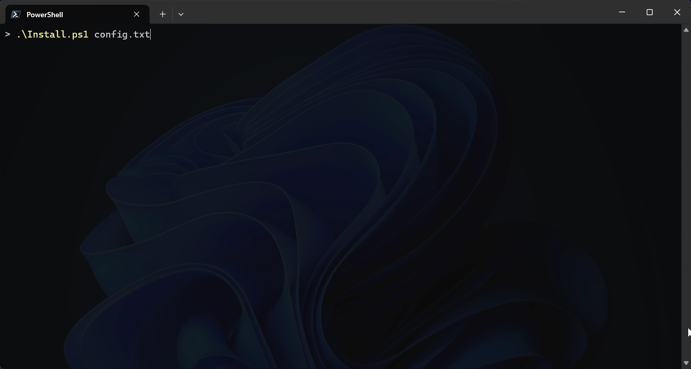

# PowerShell-скрипт по автоустановке v2rayn

Read in [English](./README.md)

PowerShell-скрипт, который скачивает и устанавливает последнюю портативную
версию [v2rayN](https://github.com/2dust/v2rayN) (Windows x64) самостоятельно.



## Проблема

Во время помощи пользователям Windows по установке v2rayn
нужно открыть браузер, порыться в GitHub, найти последний релиз
v2rayN, скачать его, а потом добавить конфиги. Это может быть регулярно.

## Решение

Каждый этот шаг можно автоматизировать с PowerShell 5+, который и ещё
предустановлен по-умолчанию на каждой современной Windows.

## Что делает

1. Запрос к GitHub API к последнему релизу v2rayN и загружает
`v2rayN-windows-64.zip` — версия не захардкожена.
2. Распаковывает архив, используя командлет `Expand-Archive` (без дополнительных
инструментов).
3. Устанавливает v2rayN ниже по уровню, откуда был запущен скрипт.
4. Создает ярлык `v2rayN.lnk` на рабочем столе.
5. Опционально: конфиги добавляются в буфер обмена. 

## Системные требования

- Windows 10/11, 64-bit
- PowerShell 5.0+ (установлен по-умолчанию)

## Инструкция

### Разрешить исполнение скриптов (единоразово)

По-умолчанию Windows блокирует запуск локальных файлов с расширением `.ps1`.
Откройте PowerShell и выполните:

```powershell
Set-ExecutionPolicy RemoteSigned -Scope CurrentUser
```

Это позволяет запускать локально созданные скрипты, при этом требуя наличия 
подписанных скриптов из удаленных источников.

```powershell
powershell -ExecutionPolicy Bypass -File .\Install.ps1
```

### Запуск

```powershell
.\Install.ps1
```

Загружается последний релиз, распаковывается папка v2rayN ниже по уровню, 
откуда был запущен скрипт, создается ярлык на рабочем столе.

### Запуск с конфигами

```powershell
.\Install.ps1 -ConfigFile "config.txt"
```

`config.txt` должен содержать конфиги построчно, например так:

```
vmess://...
vless://...
trojan://...
```

The script copies the file's contents to the clipboard and launches v2rayN.
In the main v2rayN window, press **Ctrl+V** (или в меню **Configuration → Import
Share Links from clipboard**) to add the servers — this is v2rayN's own
built-in import feature, so no internal files are modified directly.

Скрипт копирует содержимое файла в буфер обмена и запускает v2rayN.
В окне v2rayN используйте **Ctrl+V** (или в меню **Configuration → Import
Share Links from clipboard**), чтобы добавить серверы — это встроенная
у v2rayN функция.

## Примечания

- Повторный запуск скрипта обновляет существуюшую папку `v2rayN`.